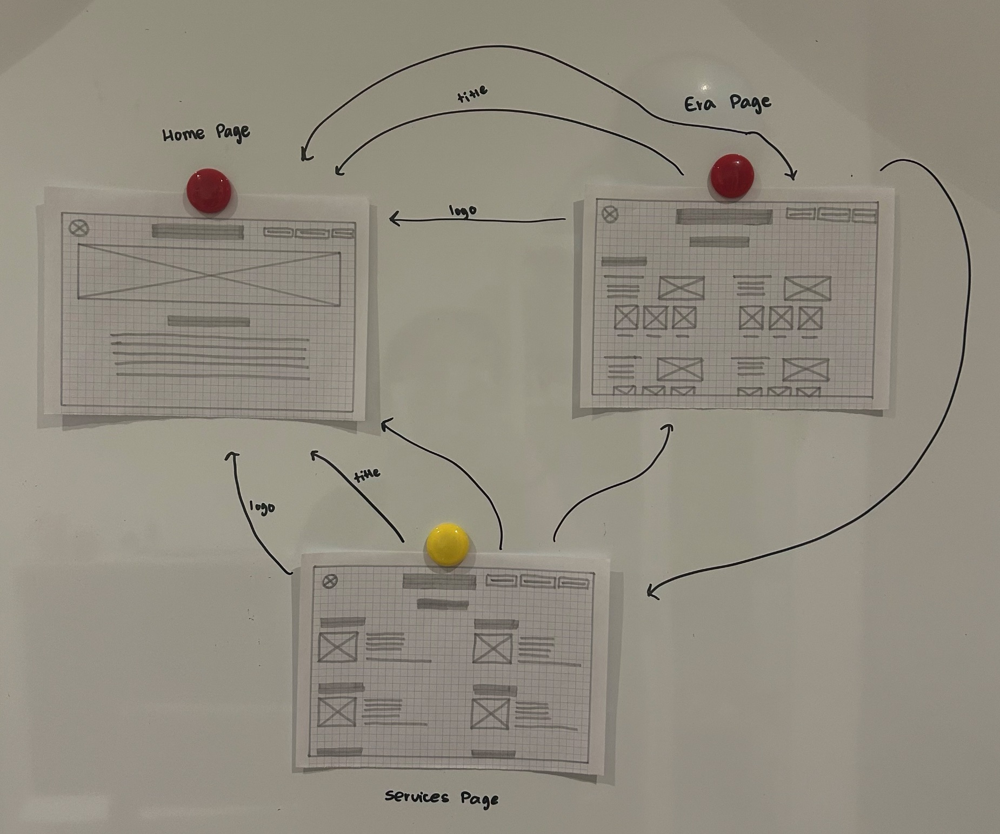
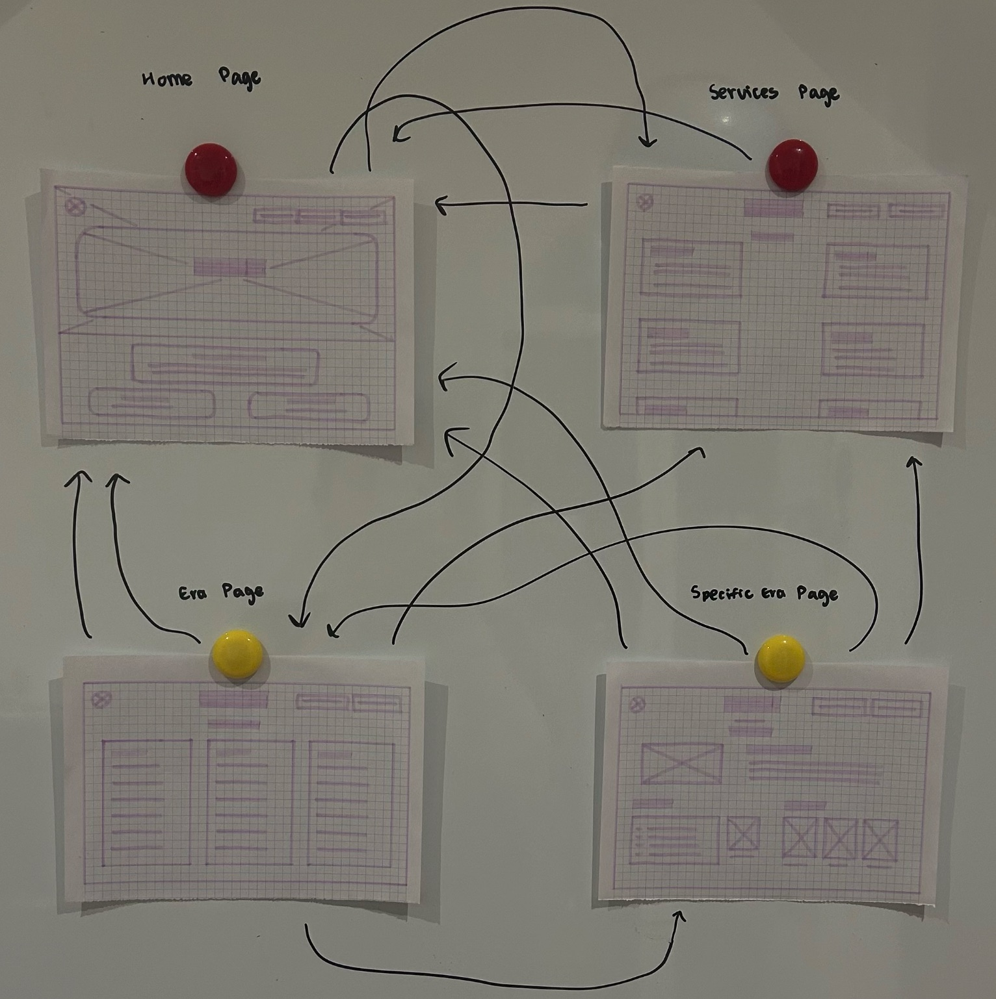
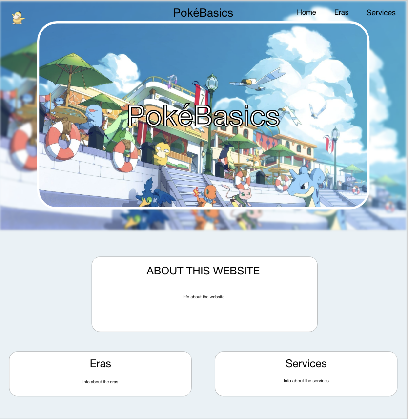
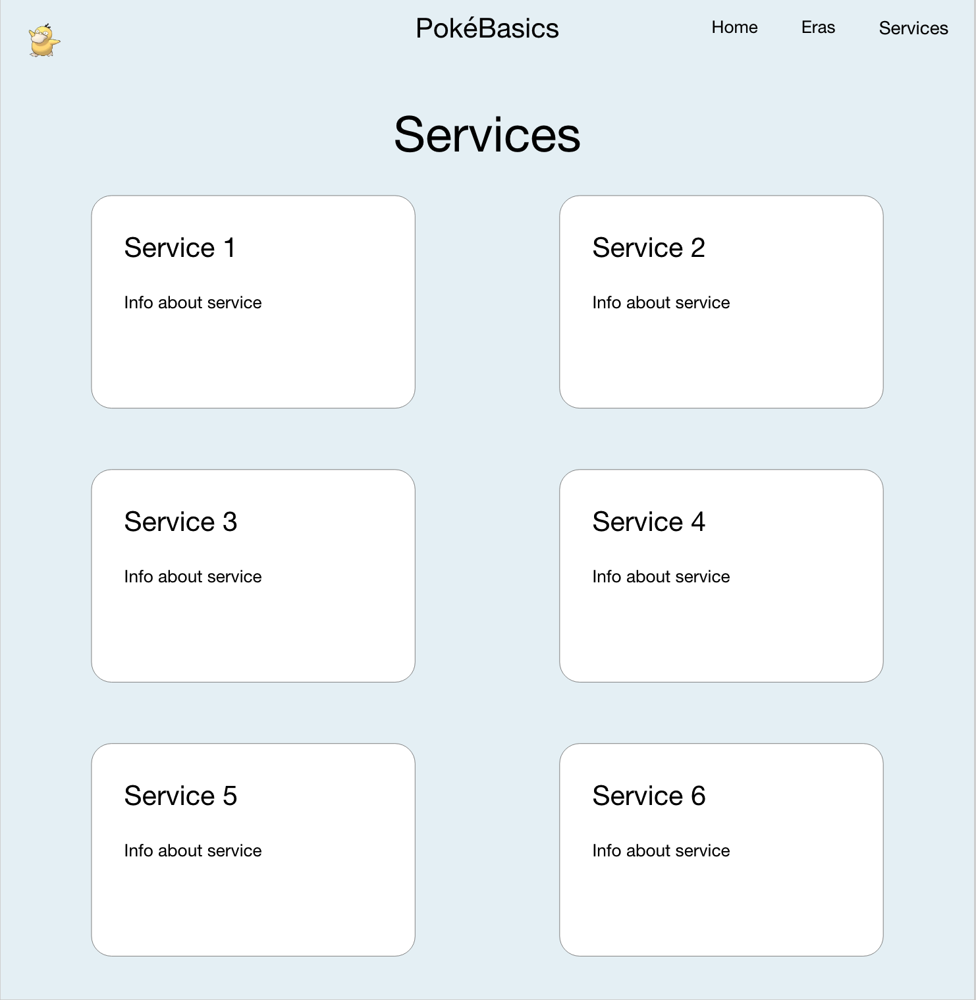

# 10CT-Task-2

## Diverge
### Mind Map

### 6 Big Ideas
| Idea Name | What It Does | Influence It Explores | Who It Helps |
| - | - | - | - |
| Recipe with my groceries | When people enter the groceries they have at home, the website will generate different recipes they can try. | It influences people not to waste food. | People who have a hard time using groceries to cook meals. |
| All about F1 | Informs people about everything on F1 | How F1 influences people through its drivers, teams, competitions and the large fan community. | People who want to start getting into F1 | 
| PokéBasics | Informs people on the different series' on pokemon cards and where to start, etc. | To encourages people to become informed and responsible Pokémon card collectors by helping beginners understand the history, eras and services of the Pokémon TCG. | Helps people who are starting to get interested in pokemon cards and tells them where to start. | 
| Match your mood | Generates music based on your mood and also if you enter in a song you like, it will find you similar ones | How music can influence people's emotions and moods. | People who want to discover new music that matches how they feel. |
| Online Lego | You can play with lego blocks online and create whatever you want | Influences creativity and encourages people to express their ideas through building. | Helps those who have limited movements in their hands or can't buy physical lego | 
| Don't be alone | Teaches people how to deal with people with different personalities based on MBTI | How understanding personality differences can influence communication and relationships. | Those who have trouble talking and socialising with others |

## Converge
### Impact / Effort Matrix
 

### Peer SWOT Analysis
 
 

### Reflect and Choose
The Impact/Effort Matrix and Peer SWOT Analysis helped me compare my ideas based on their potential impact, effort required and possible strengths and weaknesses. Looking at my Impact/Effort Matrix, 'Recipe with my groceries' had a high impact but also required a high amount of effort while 'Online Lego' had lower impact but the same high effort. 'Match your mood' had a relatively high impact but would still require a moderate amount of effort and 'Don't be alone' had low effort but also a lower impact. 'All about F1' and 'PokéBasics' were both more in the manageable area of the matrix, so I narrowed my choices down to these two as I am also interested in these two fields. After the completion of my SWOT Analysis, I chose 'PokéBasics' as it had less competition than the F1 idea and had more positive aspects, such as bringing collectors together, providing accessible information and helping beginners make informed decisions about collecting Pokémon cards.   
**Final Idea : PokéBasics**

## Requirements Outline
### Functional Requirements
My website must allow users to navigate between Home, Eras and Services pages. User should be able to click buttons, links and other interactive elements to access different information. The website must provide information about different Pokémon card eras and services, while using multimedia such as images and visual design elements. It should also have a clear message that encourages users to explore and learn more about Pokémon cards.

### Non-Functional Requirements
**Performance**  
My website should load quickly without long delays. Images should be appropriately sized so they do not significantly slow down the website. Buttons, links and other interactive elements should also respond quickly when selected.

**Usability**  
The website should have clear and consistent navigation so users can easily find information. Text should be easy to read and information should be organised into clear sections. Colours, fonts and layouts should remain consistent across the different pages, making the website simple for users to understand and navigate.

**Reliability**  
All pages, buttons and links should work correctly. Images and other multimedia should load properly, and the website should display correctly across common web browsers. The information should remain available when users return to the website.

**Security**  
The website should not collect unnecessary personal information from users. It should not require users to create an account or provide passwords. External links should lead to trusted websites, and the website files should be protected from unauthorised changes.

## Researching and Planning
### Explore Existing Ideas
- **Fandom**   

| Plus | Minus | Implications |
| - | - | - |
| Provides detailed information about different fandoms and helps people discover new interests. | Some information is created or edited by users, so it may not always be accurate. | It can encourage people to become more involved in a fandom and connect with others who share their interests. |

- **Wikipedia**

| Plus | Minus | Implications |
| - | - | - |
| Provides free information about a huge range of topics and is easy for people to access. | Anyone can edit many pages, sometimes leading to false or unreliable information. | It can strongly influence what people learn and believe because it is often one of the first websites people use when researching a topic. |

- **Formula 1** 

| Plus | Minus | Implications |
| - | - | - |
| Provides news, videos, race information, statistics and interactive features that help fans become more involved in F1. | Some features require users to pay for a subscription, which limits access to certain content for free users. | It can influence people to become interested in F1, follow particular drivers or teams and become part of the wider F1 fan community. F1 reported more than 126 million social followers in 2026. |

### Secondary Research
The Pokémon Trading Card Game (TCG) has grown into a very large market, with many people now buying cards as investments. This has caused some cards to become much more expensive, along with product shortages and people buying cards to resell them for a higher price. This can make it difficult and expensive for beginners to start collecting. Because of this, beginners need simple and educational resources that teach them about Pokémon cards and help them make informed decisions. This has influenced my project because my website provides easy-to-understand information about different Pokémon card eras and services, helping new collectors understand the hobby before spending money.

Research has also shown that Pokémon can have a strong connection to people who grew up with the franchise. A brain-imaging study from Stanford University found that people who were exposed to Pokémon as children developed a specific area of the brain that responds to Pokémon characters. This shows that Pokémon can create strong and lasting memories and connections. Collecting Pokémon cards can therefore be more than just buying cards for their value. It can also be an enjoyable hobby connected to people's childhood interests and memories. My website aims to encourage beginners to enjoy collecting Pokémon cards while learning more about the hobby and making informed choices.

Sources :  
- https://news.stanford.edu/stories/2019/05/regular-pokemon-players-pikachu-brain 
- https://konvi.app/magazine/article/how-millennials-are-driving-the-pokemon-card-investment-boom/ 
- https://switzer.com.au/how-pokemon-cards-became-a-market-beating-investment-and-why-a-bubble-is-now-brewing/

### Primary Research
### Quantitative  
| How would you rate your knowledge on Pokemon cards? (1-none, 5-a lot) | Would you be interested in collecting pokemon cards? | Would you be more interested in collecting or earning? | If earning, would different websites on checking price ranges and real-time market values help? | Would information about the different eras help or maybe the most popular sets and cards?  |
| - | - | - | - | - |
| 2 | maybe? 🤷🏻‍♀️ | Earning | Yeh | Maybe |
| 1 | maybe? 🤷🏻‍♀️ | Collecting | Yeh | Yeh |
| 1 | maybe? 🤷🏻‍♀️ | Earning | Yeh | Yeh |
| 2 | maybe? 🤷🏻‍♀️ | Earning | Yeh | Yeh |
| 4 | YESSSS HEH | Collecting | Yeh | Yeh |
| 1 | YESSSS HEH | Collecting | Yeh | Yeh |
| 3 | YESSSS HEH | Collecting | Yeh | Yeh |
| 1 | maybe? 🤷🏻‍♀️ | Earning | Yeh | Yeh |
| 1 | maybe? 🤷🏻‍♀️ | Earning | Yeh | Maybe |
| 2 | maybe? 🤷🏻‍♀️ | Earning | Yeh | Yeh |

### Qualitative
**If you did start collecting, what would you be the most confused about?**  
- How much they cost if you resell it
- like the power levels and rarity
- Purpose of the cards lien what the characters do
- What they're for
- when the cards were made
- how to known card valuable
- the names and then the judgy people like "do u know this guy name" from like the newest gen and I say "nah" then they say "aw u not real fan" but I am !!!
- everything...
- how to make money
- Which ones are the most expensive

**If you did start collecting, what information would be the most useful to you?**
- Which ones are good and which ones are bad
- how rare or common it is 
- Characters
- information about the cards background e.g. what time period it came from, what series, etc
- how to know card valuable
- the best pack to open for my fav chars
- im not sure bc idk anything abt collecting pokemone cards
- checking price ranges and real-time market also a layout of all the cards (just to see)
- How much each if the cards cost

### Evaluation
The results showed that most participants had limited knowledge about Pokémon cards, with 8/10 people rating their knowledge as 1 or 2 out of 5. However, 2 participants rated their knowledge as 3 and 4, showing that my survey included both beginners and people with some knowledge of Pokémon cards. All 10 participants said that information about card prices and market values would be useful, while 8/10 said that information about different eras, popular sets and cards would be useful. The results also showed that 6 people were more interested in earning money, while 4 were more interested in collecting This suggests that both the collecting and financial sides of Pokémon cards are important to my target audience. 

The qualitative responses also showed that beginners are mainly confused about card values, rarity, different eras, what the cards are used for and how to identify the valuable cards. Several people specifically wanted information about prices and which cards are rare or valuable. Others wanted to learn about the history of cards, different series and characters. This influenced my project by showing that my website needs to provide simple and beginner-friendly information rather than assuming users already know about Pokémon cards. Moving forward, I will focus on making the Eras section clear and easy to understand and include information about popular sets and the rarity. Including card values would go against my idea of encouraging people to get interested in the cards themselves rather than just the prices. I will also add a Services section by explaining services related to checking card values and other useful resources the users might want. This will help my website influence beginners to become more informed about Pokémon card collecting before spending or trying to make money from their cards.

### UI/UX Design
**Alternative 1**
 

**Alternative 2**
 

### Prototype
 
 

## Producing and Implementing
### Documentation
**I tried to remember what I did by looking at my github but for some reason, some of it doesn't match up?**  
| Week | Development Process |
| - | - |
| 2 | I started working on my documentation by creating the documentation.md files and organising the different sections I needed to complete. I also created my mind map to brainstorm different ideas that could relate to the theme of influence. After this, I started developing my 6 Big Ideas, thinking about what each website could do, who it would help and how it could influence people. |
| 3 | I continued working on the Diverge section and nearly finished developing my ideas. I compared my different ideas and started thinking about their potential impact and the amount of effort that would be required to create each one. I also created the Impact/Effort Matrix and completed a SWOT Analysis for my ideas to help identify their strengths, weaknesses and potential problems. |
| 4 | I decided to change my original F1 idea to my Pokémon card idea, PokéBasics. I made this decision because there were already a large number of pre-existing F1 websites, which would make my idea less unique. I also felt that I was more interested in creating a website about Pokémon cards. After deciding on my new idea, I started documenting my development process and planning what information and features I would need for the website. |
| 5 | I started creating my website by following a YouTube tutorial that explained the basics of setting up a website. I used what I learned from the tutorial to begin creating the structure of my website. I then added an image banner and a title to make the homepage more visually appealing. At the same time, I started researching information about Pokémon cards, different eras and other content that I could include on my website. I organised some of this research in a Google Docs document so I could use it later when developing the pages. |
| 6 | I focused on completing my documentation and transferred the information I had collected into my documentation files. I wrote up my development information and recorded what I had completed so far. I was also trying to keep up with the practical development of my website, so I completed some of the documentation at school rather than adding everything at home because I did not have enough time outside of school. |
| 7 | I created my initial prototypes and experimented with different layouts and designs for my website. I explored how I could organise the homepage, navigation and different sections of the website. I also created alternative designs so I could compare different ideas before deciding on the final layout. Although I completed these prototypes, I put them to the side while I focused on developing the actual website. |
| 8 | I did no work during this week as I was completing my prelim exams. |
| 9 | I completed most of the development of my website this week. I created my website banner but later decided to change the design so that it worked better with my updated homepage. I then created all of my other main pages and developed the specific pages for each Pokémon card era, adding the required images and information. I also added page titles so that the name of each page would appear in the browser tab, making the website easier to identify. After completing the website, I sent it to Arisa and Vanessa to receive peer feedback and also completed their peer evaluations. I then made my final checks and finished my evaluations and documentation. Done! |

## Testing and Evaluating
### Peer Evaluation
**Me**  
My website responds to the theme of influence by encouraging people to become more informed about Pokémon card collecting. It aims to have a positive social impact by providing beginners with useful information about Pokémon cards, including the different eras, sets, rarity and card values, helping them make more informed decisions. The website is interactive through navigation buttons, links and clickable sections that allow users to explore the information at their own pace. It also includes a clear message encouraging users to learn more about Pokémon cards before collecting or buying them. Multimedia elements, including images and visual design, make the website more engaging and help users understand the information. I also considered accessibility and user experience by using a consistent layout, readable text, clear navigation and consistent colours and fonts throughout the website. Overall, my completed website successfully meets the requirements by providing an informative, interactive and beginner-friendly experience.

**Arisa**  
The website offers a highly interactive interface that is both straightforward and easy to navigate through. I really like how every element responds to the mouse as it makes it very immersive and its satisfying to use. The content is also organised and easy to understand, with lots of example images to help associate each era with a kind of aesthetic??graphics??? Idk
I do think this website is very useful for people who are new to pokemon card collecting, however I think it's more targeted for new collectors who already have a base knowledge in pokemon, which is not necessarily bad. I just personally don't know what to make with the information because I know nothing about Pokemon. However, the website is incredibly valuable as it is so informational and acts as a library of all resources and links someone would need to start or relearn their card collecting knowledge.

Also sidenote but I also really like how both the logo and website name allow users to go back to the homepage as it makes the website really easy to use and makes it more accessible as it can sometimes be hard to tell which one to click to go home.

**Vanessa**  
I think its pretty influential as pokemon is kind of a hard hobby to get into and learn, there's so many sets and knowledge and cards, and not much places you can learn about the pokemon sets and stuff so easily, its very good for beginners who want to just get a grasp on the hobby and be able to learn some basics about it, it does serve its purpose well. I would say Pokemon is global. It's very interactive in the sense that it’s not just words on a page, I like the animations of the words and buttons, the animations are consistent too so I know exactly what i’m looking at. There is a clear call to action with the arrows next to the buttons, it makes the audience want to learn more about the subjects (eras). It has lots of graphics and is spaced nicely, it feels simple yet informative at the same time without too much text overload and overstimulation. The font is also easy to read. Scroll to explore is chef's kiss wonderful (love how it fades), though I do wish it would be a little bigger, but I’m really picky with sizing so it might just be me. Also the little psyduck in the corner for home, I wish it was bigger too, I wouldn’t have known what it was for without explanation.

### Evaluation of Issues
My website considers social, ethical and legal issues by providing accurate and accessible information for people who are new to Pokémon card collecting. Socially, the website aims to help users make informed decisions rather than encouraging them to spend money without understanding the cards they are buying. Ethically, I have presented information in a clear and responsible way without making promises about making money from collecting. Legally, I considered copyright when using Pokémon card images and other visual content, and I acknowledged sources for my code where needed. I also avoided collecting personal information from users, which helps protect their privacy.

### Project Evaluation
Overall, my final website successfully meets the requirements of the project by clearly responding to the theme of influence and providing an interactive and informative experience for beginner Pokémon card collectors. It includes navigation, images, buttons, information about different eras and services and a clear purpose of helping users become more informed about collecting. My primary research also influenced the final product, as 10/10 participants said information about price ranges and market values would be useful, while 8/10 wanted information about different eras, popular sets and cards. I managed my project by planning the website, creating and editing the pages in HTML and CSS, and testing the layout and features throughout development. The final website is aimed at beginners and provides information that addresses their lack of knowledge and common confusion about Pokémon cards. Overall, the project successfully achieved its purpose of influencing users to learn more and make informed decisions about Pokémon card collecting.