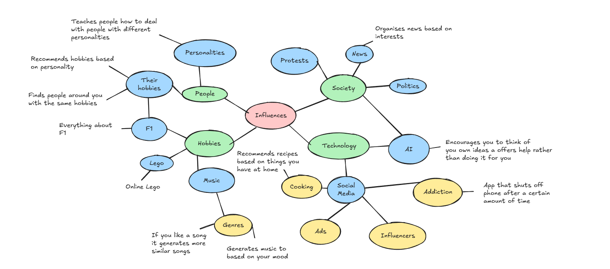
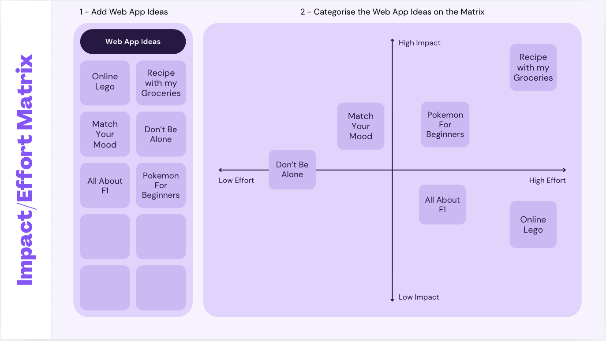
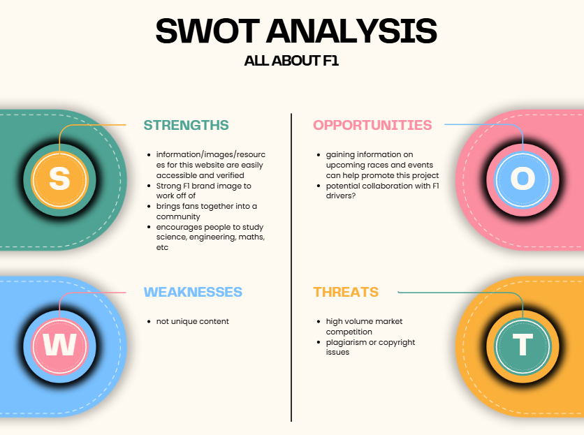
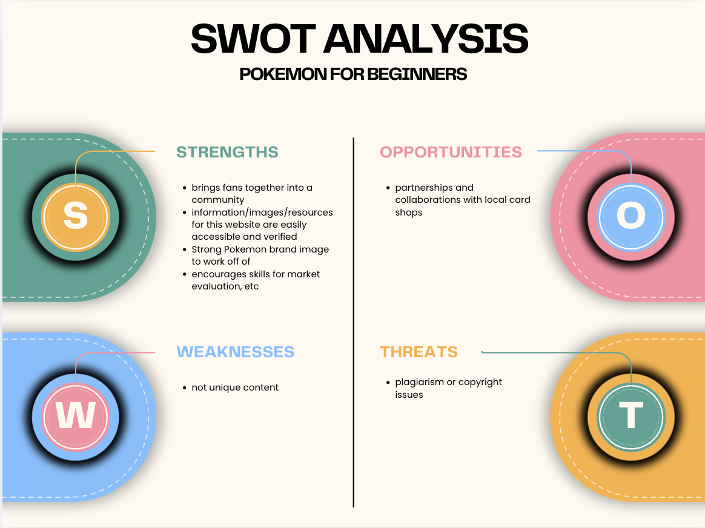

# 10CT-Task-2

## Diverge
### Mind Map

### 6 Big Ideas
| Idea Name | What It Does | Influence It Explores | Who It Helps |
| - | - | - | - |
| Recipe with my groceries | When people enter the groceries they have at home, the website will generate different recipes they can try. | It influences people not to waste food. | People who have a hard time using groceries to cook meals. |
| All about F1 | Informs people about everything on F1 |  | People who want to start getting into F1 | 
| Pokemon For Beginners |  |  | | 
| Match your mood | Generates music based on your mood and also if you enter in a song you like, it will find you similar ones |  |  |
| Online Lego | You can play with lego blocks online and create whatever you want | Influences creativity | Helps those who have limited movements in their hands or can't buy physical lego | 
| Don't be alone | Teaches people how to deal with people with different personalities based on MBTI |  | Those who have trouble talking and socialising with others |

## Converge
### Impact / Effort Matrix

### Peer SWOT Analysis

### Reflect and Choose
Based on my Impact / Effort Matrix and Peer SWOT Analysis, my ideas like 'Online Lego' and 'Recipe with my Groceries' gave my website a higher impact but required too much development effort for timeline of 5 weeks. Although 'Don't be alone' and 'Match your mood' may have been better options than 'Pokemon for Beginners' and 'All about F1', I felt like they would require too little effort for this task. In terms of my Impact / Effort Matrix for 'All about F1' and 'Pokemon for Beginners', 'Pokemon for Beginners' offered a much higher potential for impact. Looking at the SWOT Analysis, 'All about F1' had a big threat on a high volume market competition which could reduce my website' influence on users. Overall, 'Pokemon for beginners' would be my choice also considering Pokemon's rising influence these days.

## Requirements Outline
### Functional Requirements
My website will serve as a gateway for beginners to get into collecting pokemon cards. It will categorise information into the different eras of cards and show the most popular sets and individuals cards for each era. It will also provide users with other website and apps that will help with calculating card values and tools to check real-time market prices.

### Non-Functional Requirements
**Performance**  
My website must deliver a fast user experience by ensuring pages load under 3 seconds and images of different cards should be of high-quality.

**Usability**  
The platform must also have an intuitive layout that allows users to navigate easily and quickly between different eras and their popular sets and cards as well as being able to find other resources without any trouble.

**Reliability**  
The system must be highly dependable to ensure that the website it always available to users. 

**Security**  
To ensure data safety, the website will not collect personal information and all outgoing links will be checked and validated before being uploaded. 

**Accessibility**
The website must be all inclusive to users by ensuring that every image includes a descriptive text to support visually impaired individuals who are using screen readers.

## Researching and Planning
### Explore Existing Ideas
| Websites / Web Applications| Plus | Minus | Implications |
| - | - | - | - |
| Instagram | Gives small businesses and other creators a free platform to share their work and have a chance of reaching a global audience and can also help people with unique interest or hobbies find online communities all over the world. | Uses features like infinite scrolling to keep users hooked onto the app and also leads to unhealthy comparison as users constantly see edited, perfect versions of other people's lives. |  |
| Formula 1 | Gives fans access to race schedules, driver standings and news articles for free and provides recaps and team radio clips to make the races easier to follow. | Locks the best data tools and analysis behind premium subscriptions and uses cookie pop-ups to generate ad revenue from free visitors. |  |
| Amazon | Uses AI to make shopping fast, reliable and accessible for everyone while also allowing small local businesses to use their massive warehouse network to sell products worldwide without owning a factory. | Uses deceptive designs like using fake "limited stock" countdowns timers to trick buyers and also tracks what third-party shops sell on their sites and copies their best selling products to sell them cheaper under its own brand. |  |

### Secondary Research
Research information using data from at least 2-3 reputable sources.

Discuss your findings in two paragraphs or more and consider how they impact your project moving forward.

### Primary Research
Conduct primary research into your topic. Consider your target market and gather information through surveys, questionnaires and/or interviews. Make sure to include questions to gather quantitative and qualitative data.

Organise your data (e.g. quantitative into spreadsheet / qualitative into .md file)

Evaluate your findings and consider how it impacts your project moving forward.

### UI/UX Design
Generate and evaluate alternative designs using website wireframes and webpage storyboards. You may do this on paper or using Adobe XD / Figma.

### Prototype
Create a prototype of at least your home page and one another page from your website using Figma, Adobe XD or a web content management system (CMS).

## Producing and Implementing
### Documentation
Document the whole development process (including all of the above) in a Markdown (.md) file.

| Week | Development Process |
| - | - |
| 2 | Made the documentation.md files, my mind map and started the 6 big ideas. |
| 3 | I nearly finished the Diverge section and made the matrix and SWOT for my ideas. |
| 4 | I decided to change my idea from F1 to Pokemon due to the overflowing amount of pre-existing F1 websites and also started on documenting the development process. I finished the plus and minus sections of exploring existing ideas, finished my functional and non-functional requirements, did my reflect and choose section and also released my google form for the primary research section. |

## Testing and Evaluating
### Peer Evaluation
Evaluate your own project and that of your peers using predetermined criteria.

### Evaluation of Issues
Evaluation of your solution in terms of social, ethical, and legal responsibilities / issues.

### Project Evaluation
Evaluate the final product in terms of meeting requirements, project management and its impact on the target market.